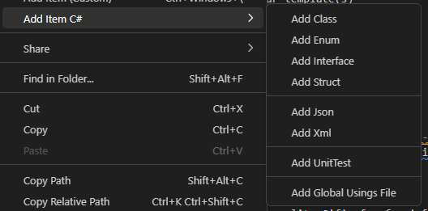

# Add-Items

Written with ❤️ by [theFish1087](https://twitter.com/thefish1087)

>**Note:** All the functionality of this extension has been already implemented in a new extension, see details right below.

Extension no longer maintained, please install the new version: [File Craft](https://marketplace.visualstudio.com/items?itemName=xtendia.file-craft)

## Announcement

A new version of Add-Items has been created, from scratch, to be more flexible and easier to use, more features and even more templates.

A new name has been chosen for the new version: [File Craft](https://marketplace.visualstudio.com/items?itemName=xtendia.file-craft), and also, a new logo.

The new version was published under a new publisher, [Xtendia](https://marketplace.visualstudio.com/publishers/xtendia), and the old version will no longer be updated.

You don't have to install the new version manually, it will be automatically updated for you, you only have to accept the update, in form of a notification, when it appears, please make sure to accept it.

This extension will be removed from the marketplace in a few days. If you want to install the new version manually, you can do it from [here](https://marketplace.visualstudio.com/items?itemName=xtendia.file-craft). If you have any questions, you can contact me on [Twitter](https://twitter.com/thefish1087), I will be happy to help you, or clarify any doubts you may have. The repository of this extension will be archived, but you can still access it, the new extension is open source too, you can access the repository from [here](https://github.com/Xtendia/FileCraft).

## What is Xtendia?

Xtendia is a new publisher, created by me, to publish my extensions, and other projects, in a more professional way. I'm sorry if this causes any inconvenience. I'm sure you will like the new version.

More projects will be published soon, so stay tuned! You can follow me on [Twitter](https://twitter.com/thefish1087) to be notified when a new project is published.

You can also request new features for File Craft, or report bugs, in the [GitHub repository](https://github.com/Xtendia/FileCraft)

Thank you so much for your support!

With love, [theFish1087](https://twitter.com/thefish1087).

Old repository: [add-items](https://github.com/thefish1087/Add-Items)  
new repository: [FileCraft](https://github.com/Xtendia/FileCraft)

---

## Old description

Here you have the old description of the extension, for reference:
👇👇👇

# Add-Items

Written with ❤️ by [theFish1087](https://twitter.com/thefish1087)

Create files, classes, enums, scripts, json, XML or any other for your favorite programming language.  
Use the templates given or create your own!

## How to use

Once the extension is installed on `vscode`, create items using the context menu:

Or run the command: `add-items: Add item` if you are into shortcuts

A shortcut is already provided for you: `Ctrl + win + /` for default items, and `Ctrl + win + \` for custom items.  

You can also create an item from the welcome page, in the `new file...` menu

## What templates are available

- C#
  - class, enums, structs, global using, xunit, interface
- Python
  - Simple hello world script
  - Main Script
- TypeScript
  - Module, class
- Data
  - Json
  - XML

And as many custom items as you can add!

## Creating items from custom templates

A full tutorial is available [here](./Resources/UserTemplates/UserDefinedTemplates.md).  
If you want to contribute with templates, please do!
Follow [this](https://github.com/thefish1087/Add-Items/issues) link to raise an issue with your template(s)

---

<!-- The following context menu is available for C#, using my other extension: [C# stuff](https://marketplace.visualstudio.com/items?itemName=TheFish2191.csharp-stuff). -->

<!--  -->

---

## Special Thanks to

### Flaticon.com

For the icon of this extension:  
<a href="https://www.flaticon.com/free-icons/computer" title="computer icons">Computer icons created by Smashicons - Flaticon</a>

### Onlineconverter.com

For the great quality Gif's for free! [Page](https://www.onlineconverter.com/).
