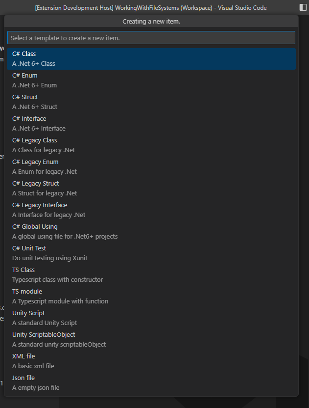
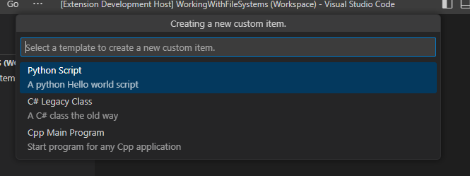
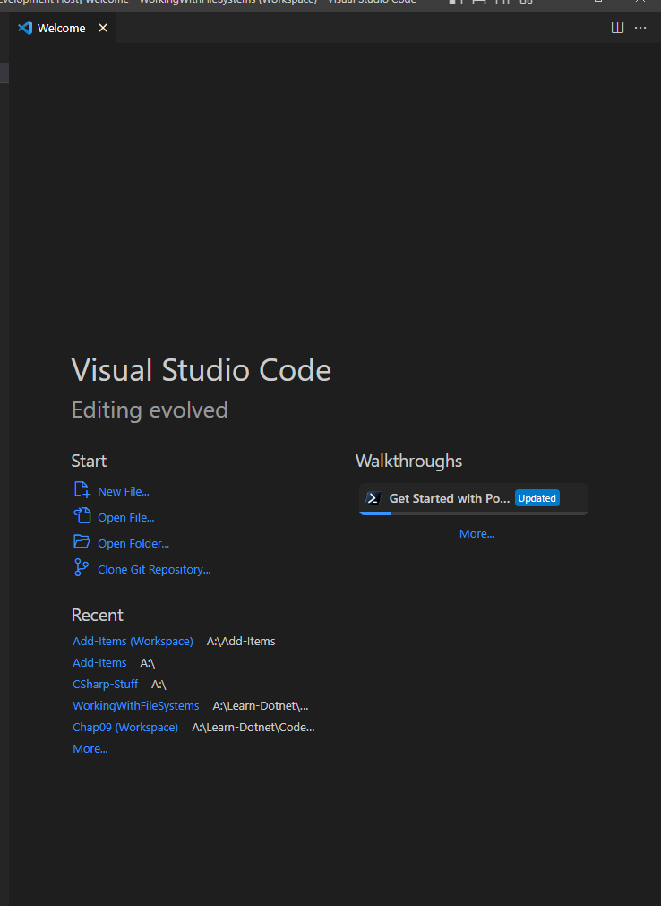

# Add-Items

Create files, classes, enums, scripts, json, XML or any other for your favorite programming language!  
Use the templates given or create your own!

## How to use

Once the extension is install on `vscode` run the command: `add-items: Add item` or `add-items: Add Item (custom)`


And select a template:



Or select a template of your own:



You can also create this extension from the welcome page, in the `new file...` menu



## Instructions to create a new templates

The instruction are added in the custom templates file itself, but here they are, in case you needed:

Run the command: `add-items: Open user templates file` to open your template file, or `add-items: Restore user templates file` to restore it to it's default state, in case you mess it up (You will lose all the content in the file).

```text
Each Template is defined with the following properties
 displayName: It will be shown in the drop down menu, as the template name
 description: It is shown below the displayName, can be left empty
 filename:    The name it will be given to the system to create a new file
 fileExt:     The file extension for the new file
 body         A vs code regular snippet
 If you haven't created any snippet yet, please read the vscode documentation here:
 https://code.visualstudio.com/docs/editor/userdefinedsnippets.

If you are creating a C# or F# template, use `[namespace]` to allow the extension create a namespace
Remember: All fields are case sensitive
If you mess up this file too much, run the command: Restore user templates file.
```

## Special Thanks to

 For the icon of this extension
<a href="https://www.flaticon.com/free-icons/computer" title="computer icons">Computer icons created by Smashicons - Flaticon</a>
