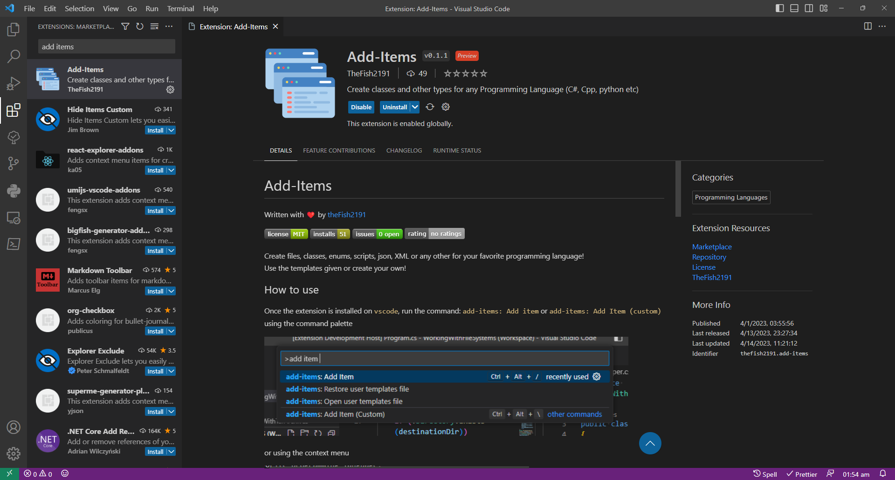
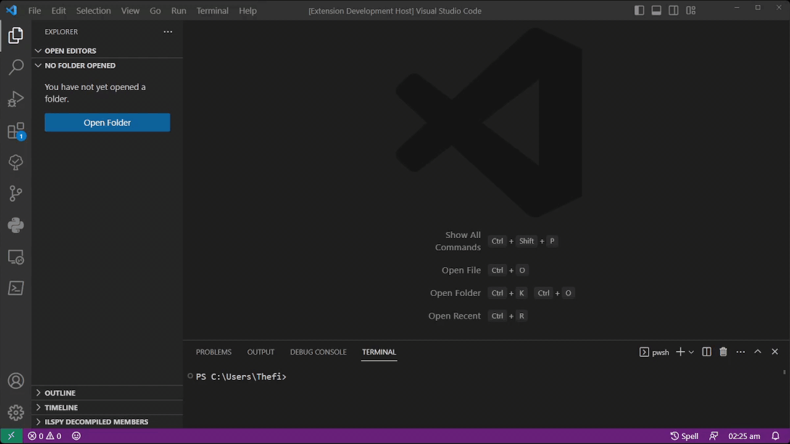
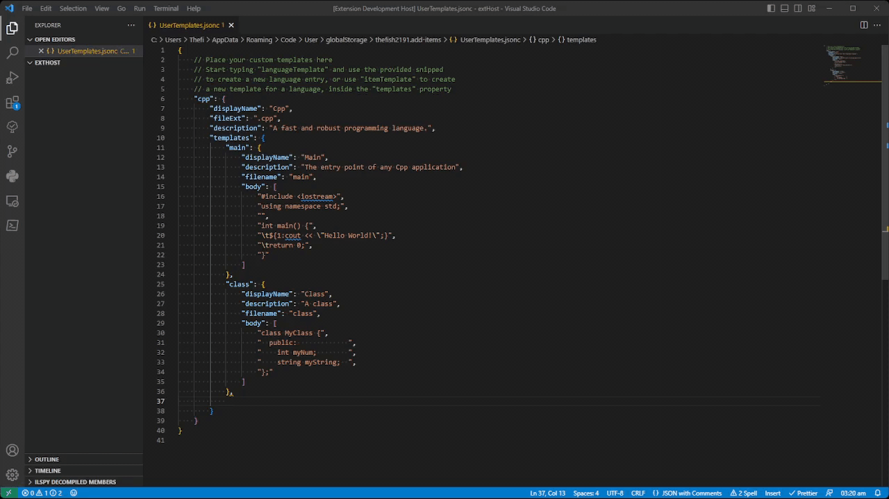

# Add-Items: User defined templates

Written with ❤️ by [theFish1087](https://twitter.com/thefish1087)

---

In this document, you will learn the fundamental concepts for building your own templates using the Add-Items extension.  
Make sure you have the [add items](https://marketplace.visualstudio.com/items?itemName=TheFish2191.add-items) extension installed and enabled on your `vscode` installation:



Then, press `Ctrl+Shift+p` and start typing: `add-items: Open User templates file`, you will be prompted to create a new file, if you haven't created it already. Alternatively, you can try to add a new custom item using both the command palette or the context menu.

> **Note**  
> If you have already used this feature before, create a copy of your templates and then run the command `add-items: Restore User templates file`. Previous versions are not compatible!



There is already one entry created for you: the language TypeScript, with two templates: A class and an Enum.

But let's assume you want to create files for the language `C++`...

## Creating custom items

To simplify the process for you, we will use one of the two snippets to fast create a new language entry, this time for `C++`, delete the entry for `JavaScript` if you want, or feel free to edit it, add more items, or remove them... We will not use that in this very tutorial.

Just start typing `languageTemplate` in the new file, and press tab to auto-complete with the snipped (if you didn't delete the `JavaScript` entry, add a comma at the end of the entry).

This is (part of) the snippet provided for you:

```JSON
"language": {
        "displayName": "Programming Language",
        "fileExt": ".txt",
        "description": "A shot description.",
        "templates": {
            "class": {
                "displayName": "class",
                "description": "A class template",
                "filename": "class",
                "body": [
                    "Line1",
                    "Line2",
                    "Line3",
                    "Line4"
                ]
            }
            ...
        }
    }
```

All the properties are necessary, and explained here:  
I recommend using camelCase notation

`language` => the programming language, `csharp`, `typeScript`,`python`...  
`displayName` => The name than will be shown in the input box (more about that latter)  
`fileExt` => The file extension for the new file that will be created  
`description` => Is shown just below the `displayName`  
`templates` => The file templates than will be used to create new items.

Let's see how to fill all fields for a `Main` program for C++:


The templates' property is quite important because it holds all the templates, in the previous example we added only one, but let's add another one:

- Add a comma at the end of the `main` obj and start typing `itemTemplate` as shown in the following gift


Any template has 4 properties:

`displayName` => Is show in a fancy way when creating a new item  
`description` => Is show just below the `displayName`  
`filename` => The name the new file will receive, regardless of the file content.  
`body` => The snipped that will be used to fill the file.

The `body` is an array of `strings`, each string represents a new line in the new file. This is actually a `vs code` standard snippet. There is already a (great) official tutorial for that, and you can read it [right here](https://code.visualstudio.com/docs/editor/userdefinedsnippets#_creating-your-own-snippets). If you already know how to create snippets, then you are good to go!

*There is another property: `fileExt`, nested in the template, this will override the `fileExt` property in the parent programming language, for example for a `html` file for `TypeScript`, you may want to have it under the language `Typescript` and not under `html`, or, the `Requirements` file, for python, it is a `.txt` file, and not a `.py` file. Add it bellow the `filename` property.*

Give it a go, create your own snipped, and use it to create your own files!

## Create your file

Now see all in action by either running the command `add-items: Add Item (Custom)` or clicking the `Add item (Custom)` button in the explorer context menu, as follows:



### C#, a special case

If you are a C# developer, you may be wondering: What about `namespaces`?

Well, don't you worry because I got your back:

Follow the process in the [Create custom items](#creating-custom-items) section, and use `[namespace]` in the exact part  of your snippet where you want to place the namespace, this is the class snipped I use to create a top level class, as an example:

```json
"csharp": {
    "displayName": "C#",
    "fileExt": "cs",
    "description": "A general-purpose high-level programming language supporting multiple paradigms.",
    "namespace": true,
    "templates": {
        "class": {
            "displayName": "Class",
            "description": "A C# top level class.",
            "filename": "Class",
            "body": [
                "namespace [namespace];",
                "",
                "public class $TM_FILENAME_BASE",
                "{",
                "\t$0",
                "}"
            ]
        },
        "class2": {
            "displayName": "Class",
            "description": "A C# top level class.",
            "filename": "Class",
            "namespace": true,
            "body": [
                "namespace [namespace];",
                "",
                "public class $TM_FILENAME_BASE",
                "{",
                "\t$0",
                "}"
            ]
        }
    }
}
```

Note: If you have templates already created for C#, previous to version 0.6.0, you need to add the namespace property and set it to true, as follows: `"namespace": true` in either the language or the template. In the example above, the first class does not have the `namespace` property at all, but it still add it, that's because the upper object (language) does have it.

The extension will replace the `[namespace]` string for an actual namespace, based on the projects, or the folder structure, when you create the file!

---

If you feel a bit generous, and want to contribute with templates, or any other thing, please do!

Follow [this](https://github.com/thefish2191/Add-Items/issues) link to raise an issue with your template(s), request, feedback, typo report, or anything you want to share with me!
